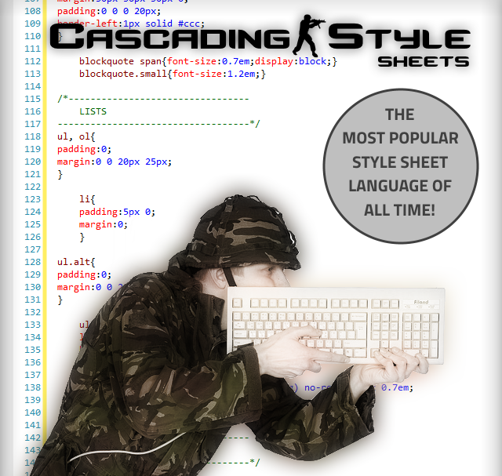

<!-- .slide: class="title" data-background="rgb(50, 255, 255)" -->
# <span>Moderní</span> webový frontend

--- <!-- .slide: class="brand" -->

[@tbedrich](https://twitter.com/tbedrich) – [tbedrich.cz](https://tbedrich.cz)

=== <!-- .slide: class="section" -->
# Responzivita

---
## Dříve
> Optimalizováno pro rozlišení 1024x768 pixelů,  
> testováno v MS Internet Explorer 6 - © 2002

---
## Dnes


---
## Viewport
= Co uživatel vidí.

Ale když se stránka nevejde na obrazovku?

```html
<meta name="viewport"
   content="width=device-width, initial-scale=1.0">
```
<!-- .element: class="fragment" -->

---
## Co s obsahem?
<ul class="fragment">
  <li><span class="red">NE:</span> mobilní verze</li>
  <li><span class="green">ANO:</span> skrýt nepodstatné</li>
  <li><span class="green">ANO:</span> přeskládat</li>
</ul>

--- <!-- .slide: data-background="rgb(180, 255, 180)" -->
# ANO,  
### nebude to vypadat všude stejně!

---
### Největší bolest?
Obrázky. A řešení?
<ul class="fragment">
  <li>`img { max-width: 100%; height: auto; }`</li>
  <li>`<picture>` – viz později</li>
  <li>SVG – viz později</li>
</ul>

--- <!-- .slide: class="hands-on" data-background="rgb(111, 84, 153)" -->
# Hands-on!
`examples/chrome-dev-tools`

===

--- <!-- .slide: data-background="rgb(0, 0, 0)" -->


---
## Media queries
= Aplikují CSS podmínečně.

```css
@media (min-width: 400px) {
  /* CSS */
}

@media screen and (min-width: 400px) and (max-width: 800px) {
  /* CSS */
}

@media (min-device-pixel-ratio: 2) {
  /* Retina CSS */
}
```
<!-- .element: class="fragment" -->

---
## Selektory
Nové nebo méně známé.

---
### Sousedské
- `elem1+elem2` – bezprostředně následující soused
- `elem1~elem2` – následující soused

---
### Atributové
- `[attribute]` – má atribut
- `[attribute=value]` – je rovno
- `[attribute^=value]` – začíná
- `[attribute$=value]` – končí
- `[attribute*=value]` – obsahuje

```css
a[href$='.pdf'] {
  /* CSS */
}
```

---
### Pseudo-třídy
- `:not(selector)` – vše nevybrané selektorem
- `:first-child` – první potomek
- `:last-child` – poslední potomek
- `:nth-child(n)` – N-tý potomek
- `:first-of-type` – první svého druhu v rodiči

```css
table tr:nth-of-type(2n+1) td {
  /* CSS */
}
```

---
### Pseudo-elementy
- `::before` – před elementem
- `::after` – za elementem
- `::selection` – vybráno kurzorem

```css
.clearfix::after {
  content: "";
  display: block;
  clear: both;
}
```

---
## Transformace
= 2D/3D škálování, rotace, posun – *až po vykreslení*.
```scss
transform: scale(1.2);
```
<ul class="fragment">
  <li>`scale(1.4)` – zoom (X + Y)</li>
  <li>`scale(1.1, 1.5)` – zoom (X, Y)</li>
  <li>`rotate(20deg)` </li>
  <li>`translate(10px, -20px)` – posun (X, Y)</li>
  <li>`rotateZ(20deg)` – 3D rotace (Z)</li>
</ul>
<div class="fragment" style="transform:rotate(-5deg);">WOOOW</div>

---
## Přechody
= Animace CSS vlastností, pokud dojde ke změně (jakkoliv).
```css
a {
  transition: all 2s ease-in-out;
  color: blue;
}
a:hover {
  color: red;
}
```
<div class="fragment" style="transition:all 2s;">Isn't it cool?</div>

---
## Animace
= Nejsou vázané na jiné změny.

**1. vytvoření**
<!-- .element: class="fragment" data-fragment-index="1" -->
```css
@keyframes example {
  0%   { background-color: red; }
  25%  { background-color: yellow; }
  50%  { background-color: orange; }
  100% { background-color: white; }
}
```
<!-- .element: class="fragment" data-fragment-index="1" -->
**2. použití**
<!-- .element: class="fragment" data-fragment-index="2" -->
```css
button {
  animation: example 5s linear 2s infinite alternate;
}
```
<!-- .element: class="fragment animated" data-fragment-index="2" -->

--- <!-- .slide: class="hands-on" data-background="rgb(111, 84, 153)" -->
# Hands-on!
`examples/css-transitions`

---
## Sloupce
= Text automaticky ve sloupcích pomocí CSS!
```css
p {
  column-count: 3;
  column-gap: 30px;
}
```
<p class="fragment" style="font-size:1rem;column-count:3;column-gap:30px;">Lorem ipsum dolor sit amet, consectetur adipisicing elit, sed do eiusmod tempor incididunt ut labore et dolore magna aliqua. Ut enim ad minim veniam, quis nostrud exercitation ullamco laboris nisi ut aliquip ex ea commodo consequat. Duis aute irure dolor in reprehenderit in voluptate velit esse cillum dolore eu fugiat nulla pariatur. Excepteur sint occaecat cupidatat non proident, sunt in culpa qui officia deserunt mollit anim id est laborum.</p>

---
## Fonty
= Lze používat fonty, které uživatel nemá.

**1. inicializace**
<!-- .element: class="fragment" data-fragment-index="1" -->
```scss
@font-face {
  font-family: 'PT Sans';
  font-style: normal; // optional
  font-weight: 400;   // optional
  src: local('PT Sans'),
     local('PTSans-Regular'),
     url('https://xx.com/ptsans.woff') format('woff'),
     url('https://xx.com/ptsans.ttf') format('truetype');
}
```
<!-- .element: class="fragment" data-fragment-index="1" -->

<strong class="fragment" data-fragment-index="2" style="font-family:'Allura', cursive;">2. použití</strong>
```scss
font-family: 'PT Sans', sans-serif;
```
<!-- .element: class="fragment" data-fragment-index="2" -->

---
## Flexbox
= Řeší klasické layoutové problémy.

**1. flex kontejner**
<!-- .element: class="fragment" data-fragment-index="1" -->
```scss
display: flex;
// flex-direction: column;
// flex-wrap: wrap;
```
<!-- .element: class="fragment" data-fragment-index="1" -->

**2. flex položka**
<!-- .element: class="fragment" data-fragment-index="2" -->
```scss
flex-grow: 1;
// flex-shrink: 1;
// flex-basis: 30%;
// order: 4;
```
<!-- .element: class="fragment" data-fragment-index="2" -->

--- <!-- .slide: class="hands-on" data-background="rgb(111, 84, 153)" -->
# Hands-on!
`examples/css-flexbox`

=== <!-- .slide: class="section" -->
# Mezistupně

---
## [Can I use ...?](http://caniuse.com/)
= Jaké technologie lze použít pro různé verze prohlížečů.

---
## Prefixy
```scss
background: black; /* fallback */
background: -webkit-linear-gradient(top, black 0%, white 100%); /* Chrome10-25,Safari5.1-6 */
background:    -moz-linear-gradient(top, black 0%, white 100%); /* FF3.6-15 */
background:         linear-gradient(to bottom, black 0%, white 100%); /* W3C, IE10+, FF16+, Chrome26+, Opera12+, Safari7+ */
    filter: progid:DXImageTransform.Microsoft.gradient(startColorstr='#000000', endColorstr='#ffffff', GradientType=0); /* IE6-9 */
```

---
## Polyfilly, Shimy
= Dovolují používat jednotné API napříč prohlížeči.

- [HTML5 Shiv](https://github.com/aFarkas/html5shiv) (HTML5 v IE6-9)
- [MathJax](https://www.mathjax.org/) (MathML v nonFF)
- a další ...

---
## [Modernizr](https://modernizr.com/)
- Detekuje podporu technologií (CSS třídy + JS objekt).
- Media query v JS.

--- <!-- .slide: class="hands-on" data-background="rgb(111, 84, 153)" -->
# Hands-on!
`examples/modernizr`

===

---
= CSS preprocesor
<p class="fragment">`style.scss` → **kompilace** → `style.css`</p>

---
## Proměnné
Opakují se barvy, rozměry, ...?

**1. definice**
<!-- .element: class="fragment" data-fragment-index="1" -->
```scss
$brand-primary: #ffff00;
$large-space: 20px;
```
<!-- .element: class="fragment" data-fragment-index="1" -->

**2. použití**
<!-- .element: class="fragment" data-fragment-index="2" -->
```scss
background-color: $brand-primary;
padding: 0 $large-space;
```
<!-- .element: class="fragment" data-fragment-index="2" -->


---
## Import
= Skládání souborů při kompilaci.
<p class="fragment" data-fragment-index="1">≠ Importy v CSS (HTTP požadavky).</p>

```scss
@import 'header';
```
<!-- .element: class="fragment" data-fragment-index="2" -->

---
## Vnořování
Opakují se selektory? Přehlednost?

```scss
ul.menu {
  list-style-type: none;
  &, li {
    padding: 0;
  }
}
```
<!-- .element: class="fragment" data-fragment-index="1" -->

```css
/* zkompilované CSS */
ul.menu {
  list-style-type: none;
}
ul.menu, ul.menu li {
  padding: 0;
}
```
<!-- .element: class="fragment" data-fragment-index="2" -->

---
## Mixiny
Opakují se kousky kódu?

**1. definice**
<!-- .element: class="fragment" data-fragment-index="1" -->
```scss
@mixin list-inline {
  list-style-type: none;
  &, & li {
    padding: 0;
    display: inline;
  }
}
```
<!-- .element: class="fragment" data-fragment-index="1" -->

**2. použití**
<!-- .element: class="fragment" data-fragment-index="2" -->
```scss
ul.menu {
  @include list-inline;
}
```
<!-- .element: class="fragment" data-fragment-index="2" -->

---
## Dědičnost
Jeden prvek vychází z druhého?

**1. rodič**
<!-- .element: class="fragment" data-fragment-index="1" -->
```scss
.message {
  padding: 20px;
  border: 2px solid #ccc;
}
```
<!-- .element: class="fragment" data-fragment-index="1" -->

**2. potomek**
<!-- .element: class="fragment" data-fragment-index="2" -->
```scss
.error {
  @extends .message;
  border-color: red;
}
```
<!-- .element: class="fragment" data-fragment-index="2" -->

---
## Matematika
= Někdy je lepší zapsat výpočet, než výsledek.

```scss
.left {
  width: 5/12 * 100%;
}
.right {
  width: 7/12 * 100%;
}
```
<!-- .element: class="fragment" data-fragment-index="1" -->

```css
/* zkompilované CSS */
.left {
  width: 41.66667%;
}
.right {
  width: 58.33333%;
}
```
<!-- .element: class="fragment" data-fragment-index="2" -->

---
## [Funkce](http://sass-lang.com/documentation/Sass/Script/Functions.html)
= Transformují parametry.

```scss
.error {
  background-color: fade-out(desaturate(red, 50%), 0.2);
}
```
<!-- .element: class="fragment" data-fragment-index="1" -->

```css
/* zkompilované CSS */
.error {
  background-color: rgba(191, 64, 64, 0.8);
}
```
<!-- .element: class="fragment" data-fragment-index="2" -->

--- <!-- .slide: class="hands-on" data-background="rgb(111, 84, 153)" -->
# Hands-on!
`examples/sass`

===

---
= Automatizace opakujících se úkolů.
<ul class="fragment">
  <li>kompilace SASS</li>
  <li>prefixování</li>
  <li>minifikace a spojování JS</li>
  <li>kopírování souborů sem tam</li>
  <li>a další ...</li>
</ul>

---
## Co nabízí Gulp?
- `gulp.task(name, deps, fn)` – vytvoří úkol
- `gulp.src(globs)` – vytvoří rouru
- `gulp.dest(path)` – zapíše výsledek
- `gulp.watch(globs, task)` – při změně spustí úkol

---
## `gulpfile.js`
```js
var gulp = require('gulp');

gulp.task('default', [], function () {
  // do something cool
});
```
**Spuštění**
<!-- .element: class="fragment" data-fragment-index="1" -->
```bash
$ gulp
$ gulp default
```
<!-- .element: class="fragment" data-fragment-index="1" -->

---
## Pluginy
= NPM balíčky.  
Aplikují se pomocí volání JS funkce uvniř *roury* (pipe).

- `gulp-sass`
- `gulp-autoprefixer`
- `gulp-concat`
- `gulp-uglify`
- `gulp-sourcemaps`
- `browser-sync`

```bash
$ npm install --save-dev gulp-sass
```
<!-- .element: class="fragment" data-fragment-index="1" -->

---
## Kompilace SASS
```js
var gulp = require('gulp');
var sass = require('gulp-sass');   // load plugin
```
```js
gulp.task('css', [], function () {
  gulp.src('styles.scss')      // get source
    .pipe(sass())              // pipe to plugin
    .pipe(gulp.dest('out'));   // pipe to output
});
```
<!-- .element: class="fragment" data-fragment-index="1" -->
```js
gulp.task('watch', ['css'], function () {
  gulp.watch('*.scss', 'css');   // run "css" task on file change
});
```
<!-- .element: class="fragment" data-fragment-index="2" -->

```bash
$ gulp watch
```
<!-- .element: class="fragment" data-fragment-index="3" -->

--- <!-- .slide: class="hands-on" data-background="rgb(111, 84, 153)" -->
# Hands-on!
`examples/gulp`

===

---
### Víte, jak rozeznat HTML od HTML5?

Otevřete Internet Explorer. Pokud to nefunguje, je to HTML5.
<!-- .element: class="fragment" -->

---
## Stručně, prosím!
```js
<!DOCTYPE HTML PUBLIC "-//W3C//DTD HTML 4.01//EN"
  "http://www.w3.org/TR/html4/strict.dtd">
```
<div class="text-center">↓</div>
```js
<!DOCTYPE html>
```
---
### Skripty
```html
<script src="script.js" type="text/javascript"></script>
```
<div class="text-center">↓</div>
```html
<script src="script.js"></script>
```
---
### Styly
```html
<link rel="stylesheet" href="style.css" type="text/css">
```
<div class="text-center">↓</div>
```html
<link rel="stylesheet" href="style.css">
```
---
### Styly \#2
```html
<style type="text/css"></style>
```
<div class="text-center">↓</div>
```html
<style></style>
```

---
## Sémantické tagy
- `<nav>` – jakákoliv navigace
- `<header>` – hlavička dokumentu nebo bloku
- `<footer>` – patička dokumentu nebo bloku
- `<article>` – nezávislý blok obsahu
- `<aside>` – sidebar
- a další ...

---
## Vlastní atributy
`data-xxx="yyy"`
```html
<em data-tooltip="Help text...">Do an action!</em>
```

---
## Formuláře

--- <!-- .slide: class="inputs" -->
### Nové typy
<table>
    <tr>
        <td>`email`</td>
        <td class="green">✔</td>
        <td><input type="email"></td>
    </tr>
    <tr>
        <td>`number`</td>
        <td class="green">✔</td>
        <td><input type="number"></td>
    </tr>
    <tr>
        <td>`range`</td>
        <td class="yellow">✔</td>
        <td><input type="range"></td>
    </tr>
    <tr>
        <td>`date`</td>
        <td class="red">✗</td>
        <td><input type="date"></td>
    </tr>
    <tr>
        <td>`color`</td>
        <td class="red">✗</td>
        <td><input type="color"></td>
    </tr>
    <tr>
        <td>a další</td>
        <td class="red">✗</td>
        <td></td>
    </tr>
</table>

--- <!-- .slide: class="inputs" -->
### Nové atributy
<table>
    <tr>
        <td>`placeholder`</td>
        <td class="green">✔</td>
        <td><input type="text" placeholder="test"></td>
    </tr>
    <tr>
        <td>`required`</td>
        <td class="green">✔</td>
        <td><input type="text" required></td>
    </tr>
    <tr>
        <td>`min`, `max`, `step`</td>
        <td class="yellow">✔</td>
        <td><input type="number" min="10" max="20" step="2"></td>
    </tr>
    <tr>
        <td>`multiple`</td>
        <td class="yellow">✔</td>
        <td>
            <select multiple size="3">
                <option>lorem ipsum</option>
                <option>dolor sit amet</option>
            </select>
        </td>
    </tr>
    <tr>
        <td>`autofocus`</td>
        <td class="yellow">✔</td>
        <td><input type="text"></td>
    </tr>
</table>

---
## Audio
```html
<audio controls>
  <source src="song.mp3" type="audio/mpeg">
  Sorry, no audio for you.
</audio>
```

<audio controls>
  <source src="assets/shot.mp3" type="audio/mpeg">
  Sorry, no audio for you.
</audio>

---
## Video
```html
<video>
  <source src="movie.webm" type="video/webm">
  <source src="movie.mp4" type="video/mp4"> <!-- H.264 -->
  Sorry, no video for you.
</video>
```

---
### Dostupné atributy
- `controls` – ovládání
- `muted`
- `autoplay`
- `loop`
- `poster` (video) – obrázek před spuštěním přehrávání
- `width`, `height` (video) – rozměry

---
### Typické použití
= `<video>` + vlastní JS přehrávač.

---
## Responzivní obrázky
= Podle výsledku media query se vybere obrázek.
```html
<picture>
  <source srcset="large.jpg" media="(min-width: 600px)">
  <source srcset="small.jpg">
  
</picture>
```
```html
<source srcset="small.jpg 1x, small-retina.jpg 2x">
```
<!-- .element: class="fragment" -->
```html
<source srcset="logo.svg" type="image/svg+xml">
```
<!-- .element: class="fragment" -->

---
## Canvas
= Kontejner pro grafiku kreslenou pomocí JS.
```html
<canvas id="drawing">
  Sorry, no canvas for you.
</canvas>
```

**Kreslí po snímcích!**
<!-- .element: class="fragment" data-fragment-index="1" -->

---
## SVG
= Scalable Vector Graphics

```html

```
<!-- .element: class="fragment" data-fragment-index="1" -->

```css
div {
  background-image: url("image.svg");
}
```
<!-- .element: class="fragment" data-fragment-index="2" -->

```html
<svg>
  ...
</svg>
```
<!-- .element: class="fragment" data-fragment-index="3" -->

---
### Kde vzít SVG?
- stáhnout z webu
- nakreslit v Adobe Illustrator, Inkscape, CorelDRAW, ...
- napsat ručně

---
#### Píšeme ručně...
- `<line>` – čára
- `<circle>` – kruh
- `<rect>` – obdélník
- `<text>` – text
- a další (elipsa, polygon, ...)

---
#### [Libovolný tvar](https://developer.mozilla.org/en-US/docs/Web/SVG/Attribute/d)
```html
<path d="M 100 100 L 300 100 L 200 300 Z" />
```

<svg width="200" height="200">
    <path d="M 0 0 L 200 0 L 100 200 Z" />
</svg>

---
#### Skupina
```html
<g transform="rotate(-20)">
  <rect x="0" y="0" height="50" width="100" fill="black" />
  <text x="0" y="50" fill="white">WOW</text>
</g>
```
<svg width="200" height="200">
    <g transform="rotate(-20)">
      <rect x="0" y="0" height="50" width="100" fill="black" />
      <text x="0" y="50" fill="white">WOW</text>
    </g>
</svg>

---
### A dál?
(nápověda: `<svg>` tag je součástí DOM...)
- CSS animace, transformace, přechody <!-- .element: class="fragment" data-fragment-index="1" -->
- JS události <!-- .element: class="fragment" data-fragment-index="2" -->

--- <!-- .slide: class="hands-on" data-background="rgb(111, 84, 153)" -->
# Hands-on!
`examples/svg`

===


---
= Frontend framework.

= Hromada připraveného HTML + CSS + JS. <!-- .element: class="fragment" data-fragment-index="1" -->

---


---
## Bootstrap ...
- ... umožní vytvořit responzivní *layout*
- ... *ostyluje* běžné HTML elementy (formuláře, tabulky, ...)
- ... poskytne *komponenty* (panely, menu, ...)

---
## Layout
= 12 sloupcová mřížka, lze vnořovat.

- `.container` – kontejner (celková šířka)
- `.row` – řádek (`clear:both;`)
- `.col-XX-YY` – sloupec (šířka sloupce)

```html
<div class="container">
  <div class="row">
    <div class="col-sm-4">Sidebar</div>
    <div class="col-sm-8">Content</div>
  </div>
</div>
```
 <!-- .element: class="fragment" data-fragment-index="1" -->

---
### Pravidla mřížky

<table>
  <thead>
  <tr>
    <th>&lt;768px</th>
    <th>≥768px</th>
    <th>≥992px</th>
    <th>≥1200px</th>
  </tr>
  </thead>
  <tbody>
  <tr>
    <td>Horizontal</td>
    <td colspan="3">Vertical below breakpoints, then horizontal</td>
  </tr>
  <tr>
    <td>auto</td>
    <td>750px</td>
    <td>970px</td>
    <td>1170px</td>
  </tr>
  <tr>
    <td><code>.col-xs-</code></td>
    <td><code>.col-sm-</code></td>
    <td><code>.col-md-</code></td>
    <td><code>.col-lg-</code></td>
  </tr>
  </tbody>
</table>

---
## Sémantické barvičky
<ul class="list-colored">
  <li class="bg-primary"><code>primary</code> – primární akce</li>
  <li class="bg-success"><code>success</code> – podařilo se</li>
  <li class="bg-info"><code>info</code> – obecná informace</li>
  <li class="bg-warning"><code>warning</code> – pozor!</li>
  <li class="bg-danger"><code>danger</code> – nebezpečná akce, nepodařilo se</li>
</ul>

---
## Ikony
```html
<span class="glyphicon glyphicon-ok"
  aria-hidden="true"></span> OK
```
Myslete na přístupnost!

---
## Formuláře + tlačítka
```html
<form>
  <div class="form-group">
    <label for="email">Email:</label>
    <input type="email" class="form-control" id="email">
  </div>
  <button type="submit" class="btn btn-primary">Submit</button>
</form>
```

---
## Komponenty
= UI prvky, pro které neexistují speciální HTML tagy.

---
### Alert
= Informační hláška.
```html
<div class="alert alert-danger">
  Invalid email.
</div>
```

---
### Panel
= Vizuální kontejner pro další obsah.
```html
<div class="panel panel-default">

  <div class="panel-heading">
    <h3 class="panel-title">Panel title</h3>
  </div>

  <div class="panel-body">
    Panel content
  </div>

  <table class="table">
    ...
  </table>

</div>
```

---
### Navigace
```html
<ul class="nav nav-TODO">
  <li class="active"><a href="#">Home</a></li>
  <li><a href="#">Profile</a></li>
  <li><a href="#">Messages</a></li>
</ul>
```
- `.nav-tabs` – záložky
- `.nav-pills` – obdélníčky
- `.nav-stacked` – nad sebou
- `.nav-justified` – zarovnané do bloku

---
### A další komponenty ...
- "navbar"
- "dropdown"
- stránkování
- drobečková navigace
- štítky
- ...

--- <!-- .slide: class="hands-on" data-background="rgb(111, 84, 153)" -->
# Hands-on!
`examples/bootstrap`

===
## Zdroje obrázků
- http://www.telerik.com/blogs/announcing-the-beta-release-of-the-telerik-mobile-cloud-testing-platform
- https://redd.it/27tnc4
- https://worldvectorlogo.com/
- http://www.boss-development.biz/taxonomy/term/4

=== <!-- .slide: class="brand" -->

[@tbedrich](https://twitter.com/tbedrich) – [tbedrich.cz](https://tbedrich.cz)
